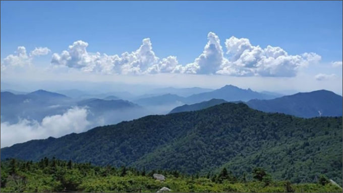

# OpenCV-Python Tutorials
OpenCV-Python Tutorials

</img>

Homework1  

https://youtu.be/fPdI0W5k0Q0?si=JMIPJoeq0lYZm4Bd

Homework2  

https://youtu.be/kPRONkmT2eg?si=ToHSstCFh4YJToiG

https://youtu.be/CkGW5W4eE6I

Homework3

</img>
